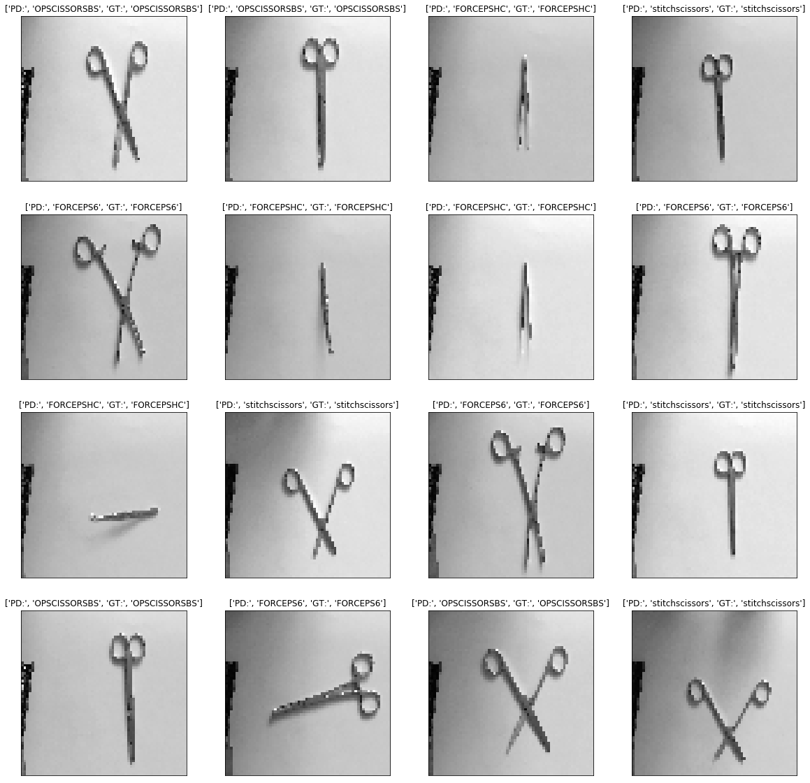
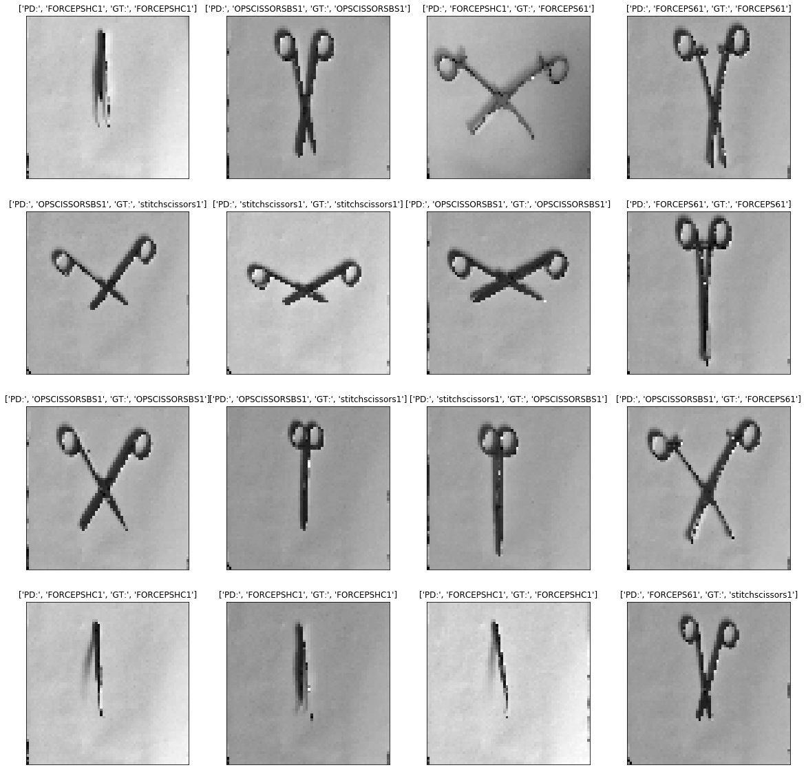
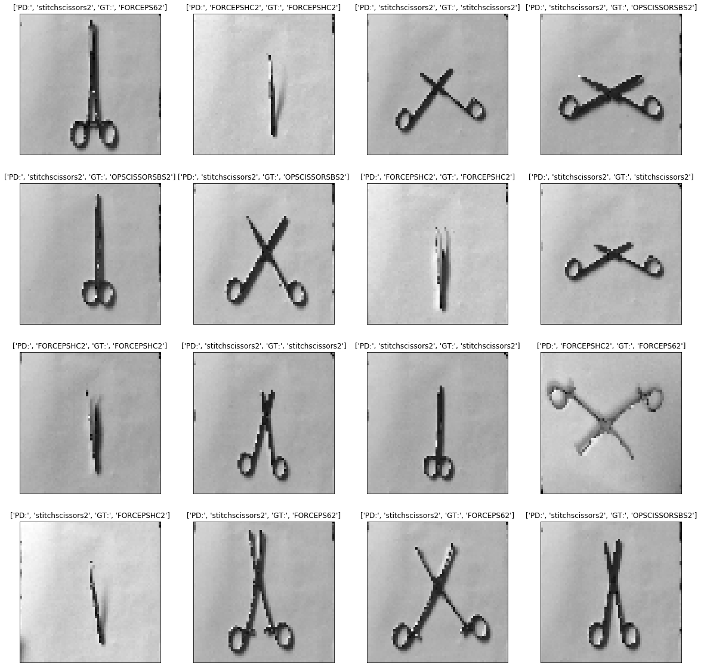

```python
#import sys
#!{sys.executable} -m pip install tqdm
```


```python
import os
current_dir = os.getcwd()

```


```python
import os
import cv2
import numpy as np
import tensorflow as tf
import matplotlib.pyplot as plt
from random import shuffle
from tqdm import tqdm
%matplotlib inline

train_data = os.path.join(current_dir, 'traindata')
test_data = os.path.join(current_dir, 'testdata')


```


```python
def one_hot_label(img):
    label = img.split('.')[0]
    if label =='OPSCISSORSBS':
        ohl = np.array([1,0,0,0])
    elif label =='FORCEPS6':
        ohl = np.array([0,1,0,0])
    elif label =='FORCEPSHC':
        ohl = np.array([0,0,1,0])    
    elif label =='stitchscissors':
        ohl = np.array([0,0,0,1])  
    return ohl

def train_data_with_label():
    train_images = []
    for i in tqdm(os.listdir(train_data)):
        path = os.path.join(train_data,i)
        if not path.endswith(".JPG"):
            continue
        img = cv2.imread(path, cv2.IMREAD_GRAYSCALE)
        img = cv2.resize(img, (64,64))
        train_images.append([np.array(img),one_hot_label(i)])
    shuffle(train_images)
    return train_images

def test_data_with_label():
    test_images = []
    for i in tqdm(os.listdir(test_data)):
        path = os.path.join(test_data,i)
        img = cv2.imread(path, cv2.IMREAD_GRAYSCALE)
        img = cv2.resize(img, (64,64))
        test_images.append([np.array(img),one_hot_label(i)])
    return test_images
    
```


```python
from keras.models import Sequential
from keras.layers import *
from keras.optimizers import *

##
training_images = train_data_with_label()
testing_images = test_data_with_label()
tr_img_data = np.array([i[0] for i in training_images]).reshape(-1,64,64,1)
tr_lbl_data = np.array([i[1] for i in training_images])
tst_img_data = np.array([i[0] for i in testing_images]).reshape(-1,64,64,1)
tst_lbl_data = np.array([i[1] for i in testing_images])
```

    100%|██████████| 17/17 [00:01<00:00, 10.97it/s]
    100%|██████████| 16/16 [00:01<00:00, 10.30it/s]


```python
model = Sequential()
model.add(InputLayer(input_shape = [64, 64, 1]))
# Step 1 - Convolution
model.add(Conv2D(filters=32, kernel_size=5, strides=1, padding= 'same', activation = 'relu'))
# Step 2 - Pooling
model.add(MaxPooling2D(pool_size =5 , padding= 'same'))
# Adding a second convolutional layer
model.add(Conv2D(filters=50, kernel_size=5, strides=1, padding= 'same', activation = 'relu'))
model.add(MaxPooling2D(pool_size =5 , padding= 'same'))
# Adding a third convolutional layer
model.add(Conv2D(filters=80, kernel_size=5, strides=1, padding= 'same', activation = 'relu'))
model.add(MaxPooling2D(pool_size =5 , padding= 'same'))
# Step 3 - Flattening
model.add(Dropout(rate=0.25))
model.add(Flatten())
# Step 4 - Full connection
model.add(Dense(units = 512, activation = 'relu'))
model.add(Dropout(rate=0.5))
model.add(Dense(units = 4, activation = 'softmax')) #sigmoid
optimizer = Adam(lr=0.001)
# Compiling the CNN
model.compile(optimizer = optimizer, loss = 'categorical_crossentropy', metrics = ['accuracy'])
#loss = 'binary_crossentropy'
model.fit(x=tr_img_data,y=tr_lbl_data,epochs=100,batch_size=100)
model.summary()

```

    Epoch 1/100
    16/16 [==============================] - 0s - loss: 8.2588 - acc: 0.0625
    Epoch 2/100
    16/16 [==============================] - 0s - loss: 6.4945 - acc: 0.3125
    Epoch 3/100
    16/16 [==============================] - 0s - loss: 7.4100 - acc: 0.2500
    Epoch 4/100
    16/16 [==============================] - 0s - loss: 8.0161 - acc: 0.1875
    Epoch 5/100
    16/16 [==============================] - 0s - loss: 8.8119 - acc: 0.1875
    Epoch 6/100
    16/16 [==============================] - 0s - loss: 5.2854 - acc: 0.2500
    Epoch 7/100
    16/16 [==============================] - 0s - loss: 5.7402 - acc: 0.1875
    Epoch 8/100
    16/16 [==============================] - 0s - loss: 5.0046 - acc: 0.1250
    Epoch 9/100
    16/16 [==============================] - 0s - loss: 5.5996 - acc: 0.1250
    Epoch 10/100
    16/16 [==============================] - 0s - loss: 3.3556 - acc: 0.3125
    Epoch 11/100
    16/16 [==============================] - 0s - loss: 2.3176 - acc: 0.3750
    Epoch 12/100
    16/16 [==============================] - 0s - loss: 1.2480 - acc: 0.4375
    Epoch 13/100
    16/16 [==============================] - 0s - loss: 1.9717 - acc: 0.1250
    Epoch 14/100
    16/16 [==============================] - 0s - loss: 1.7786 - acc: 0.5000
    Epoch 15/100
    16/16 [==============================] - 0s - loss: 1.5291 - acc: 0.3750
    Epoch 16/100
    16/16 [==============================] - 0s - loss: 1.2435 - acc: 0.3750
    Epoch 17/100
    16/16 [==============================] - 0s - loss: 1.3313 - acc: 0.3750
    Epoch 18/100
    16/16 [==============================] - 0s - loss: 1.2864 - acc: 0.5000
    Epoch 19/100
    16/16 [==============================] - 0s - loss: 1.1724 - acc: 0.4375
    Epoch 20/100
    16/16 [==============================] - 0s - loss: 1.2903 - acc: 0.2500
    Epoch 21/100
    16/16 [==============================] - 0s - loss: 1.1807 - acc: 0.4375
    Epoch 22/100
    16/16 [==============================] - 0s - loss: 1.2469 - acc: 0.5625
    Epoch 23/100
    16/16 [==============================] - 0s - loss: 1.3870 - acc: 0.3750
    Epoch 24/100
    16/16 [==============================] - 0s - loss: 1.1382 - acc: 0.5625
    Epoch 25/100
    16/16 [==============================] - 0s - loss: 1.1931 - acc: 0.3750
    Epoch 26/100
    16/16 [==============================] - 0s - loss: 1.2529 - acc: 0.3750
    Epoch 27/100
    16/16 [==============================] - 0s - loss: 1.1250 - acc: 0.6250
    Epoch 28/100
    16/16 [==============================] - 0s - loss: 1.2035 - acc: 0.6250
    Epoch 29/100
    16/16 [==============================] - 0s - loss: 1.1501 - acc: 0.4375
    Epoch 30/100
    16/16 [==============================] - 0s - loss: 0.9108 - acc: 0.6875
    Epoch 31/100
    16/16 [==============================] - 0s - loss: 1.1852 - acc: 0.5625
    Epoch 32/100
    16/16 [==============================] - 0s - loss: 0.8677 - acc: 0.7500
    Epoch 33/100
    16/16 [==============================] - 0s - loss: 0.7784 - acc: 0.8125
    Epoch 34/100
    16/16 [==============================] - 0s - loss: 0.9060 - acc: 0.7500
    Epoch 35/100
    16/16 [==============================] - 0s - loss: 1.0686 - acc: 0.5625
    Epoch 36/100
    16/16 [==============================] - 0s - loss: 0.9412 - acc: 0.5625
    Epoch 37/100
    16/16 [==============================] - 0s - loss: 0.9246 - acc: 0.7500
    Epoch 38/100
    16/16 [==============================] - 0s - loss: 0.9401 - acc: 0.6875
    Epoch 39/100
    16/16 [==============================] - 0s - loss: 0.8097 - acc: 0.7500
    Epoch 40/100
    16/16 [==============================] - 0s - loss: 0.7272 - acc: 0.6875
    Epoch 41/100
    16/16 [==============================] - 0s - loss: 0.9895 - acc: 0.5625
    Epoch 42/100
    16/16 [==============================] - 0s - loss: 0.7189 - acc: 0.6875
    Epoch 43/100
    16/16 [==============================] - 0s - loss: 0.5635 - acc: 0.8750
    Epoch 44/100
    16/16 [==============================] - 0s - loss: 0.7235 - acc: 0.7500
    Epoch 45/100
    16/16 [==============================] - 0s - loss: 0.6052 - acc: 0.7500
    Epoch 46/100
    16/16 [==============================] - 0s - loss: 0.5899 - acc: 0.6875
    Epoch 47/100
    16/16 [==============================] - 0s - loss: 0.3746 - acc: 1.0000
    Epoch 48/100
    16/16 [==============================] - 0s - loss: 0.3694 - acc: 0.9375
    Epoch 49/100
    16/16 [==============================] - 0s - loss: 0.5312 - acc: 0.8750
    Epoch 50/100
    16/16 [==============================] - 0s - loss: 0.5137 - acc: 0.8750
    Epoch 51/100
    16/16 [==============================] - 0s - loss: 0.3183 - acc: 1.0000
    Epoch 52/100
    16/16 [==============================] - 0s - loss: 0.3973 - acc: 0.9375
    Epoch 53/100
    16/16 [==============================] - 0s - loss: 0.2837 - acc: 0.8750
    Epoch 54/100
    16/16 [==============================] - 0s - loss: 0.2988 - acc: 0.9375
    Epoch 55/100
    16/16 [==============================] - 0s - loss: 0.3212 - acc: 0.9375
    Epoch 56/100
    16/16 [==============================] - 0s - loss: 0.1713 - acc: 0.9375
    Epoch 57/100
    16/16 [==============================] - 0s - loss: 0.3700 - acc: 0.8750
    Epoch 58/100
    16/16 [==============================] - 0s - loss: 0.4112 - acc: 0.8750
    Epoch 59/100
    16/16 [==============================] - 0s - loss: 0.2445 - acc: 0.9375
    Epoch 60/100
    16/16 [==============================] - 0s - loss: 0.1778 - acc: 0.9375
    Epoch 61/100
    16/16 [==============================] - 0s - loss: 0.1149 - acc: 1.0000
    Epoch 62/100
    16/16 [==============================] - 0s - loss: 0.1423 - acc: 0.9375
    Epoch 63/100
    16/16 [==============================] - 0s - loss: 0.1504 - acc: 0.9375
    Epoch 64/100
    16/16 [==============================] - 0s - loss: 0.2111 - acc: 0.9375
    Epoch 65/100
    16/16 [==============================] - 0s - loss: 0.1750 - acc: 0.9375
    Epoch 66/100
    16/16 [==============================] - 0s - loss: 0.0699 - acc: 1.0000
    Epoch 67/100
    16/16 [==============================] - 0s - loss: 0.0328 - acc: 1.0000
    Epoch 68/100
    16/16 [==============================] - 0s - loss: 0.1572 - acc: 0.9375
    Epoch 69/100
    16/16 [==============================] - 0s - loss: 0.0600 - acc: 1.0000
    Epoch 70/100
    16/16 [==============================] - 0s - loss: 0.1112 - acc: 1.0000
    Epoch 71/100
    16/16 [==============================] - 0s - loss: 0.0531 - acc: 1.0000
    Epoch 72/100
    16/16 [==============================] - 0s - loss: 0.0707 - acc: 1.0000
    Epoch 73/100
    16/16 [==============================] - 0s - loss: 0.0297 - acc: 1.0000
    Epoch 74/100
    16/16 [==============================] - 0s - loss: 0.0516 - acc: 1.0000
    Epoch 75/100
    16/16 [==============================] - 0s - loss: 0.0122 - acc: 1.0000
    Epoch 76/100
    16/16 [==============================] - 0s - loss: 0.1891 - acc: 0.9375
    Epoch 77/100
    16/16 [==============================] - 0s - loss: 0.0160 - acc: 1.0000
    Epoch 78/100
    16/16 [==============================] - 0s - loss: 0.0175 - acc: 1.0000
    Epoch 79/100
    16/16 [==============================] - 0s - loss: 0.0236 - acc: 1.0000
    Epoch 80/100
    16/16 [==============================] - 0s - loss: 0.1079 - acc: 1.0000
    Epoch 81/100
    16/16 [==============================] - 0s - loss: 0.1004 - acc: 0.9375
    Epoch 82/100
    16/16 [==============================] - 0s - loss: 0.0567 - acc: 1.0000
    Epoch 83/100
    16/16 [==============================] - 0s - loss: 0.0850 - acc: 1.0000
    Epoch 84/100
    16/16 [==============================] - 0s - loss: 0.0319 - acc: 1.0000
    Epoch 85/100
    16/16 [==============================] - 0s - loss: 0.0770 - acc: 0.9375
    Epoch 86/100
    16/16 [==============================] - 0s - loss: 0.0204 - acc: 1.0000
    Epoch 87/100
    16/16 [==============================] - 0s - loss: 0.0173 - acc: 1.0000
    Epoch 88/100
    16/16 [==============================] - 0s - loss: 0.0063 - acc: 1.0000
    Epoch 89/100
    16/16 [==============================] - 0s - loss: 0.0136 - acc: 1.0000
    Epoch 90/100
    16/16 [==============================] - 0s - loss: 0.0778 - acc: 1.0000
    Epoch 91/100
    16/16 [==============================] - 0s - loss: 0.0141 - acc: 1.0000
    Epoch 92/100
    16/16 [==============================] - 0s - loss: 0.0036 - acc: 1.0000
    Epoch 93/100
    16/16 [==============================] - 0s - loss: 0.0147 - acc: 1.0000
    Epoch 94/100
    16/16 [==============================] - 0s - loss: 0.0157 - acc: 1.0000
    Epoch 95/100
    16/16 [==============================] - 0s - loss: 0.0276 - acc: 1.0000
    Epoch 96/100
    16/16 [==============================] - 0s - loss: 0.0932 - acc: 0.9375
    Epoch 97/100
    16/16 [==============================] - 0s - loss: 0.0239 - acc: 1.0000
    Epoch 98/100
    16/16 [==============================] - 0s - loss: 0.0054 - acc: 1.0000
    Epoch 99/100
    16/16 [==============================] - 0s - loss: 0.0082 - acc: 1.0000
    Epoch 100/100
    16/16 [==============================] - 0s - loss: 0.0099 - acc: 1.0000
    _________________________________________________________________
    Layer (type)                 Output Shape              Param #   
    =================================================================
    input_3 (InputLayer)         (None, 64, 64, 1)         0         
    _________________________________________________________________
    conv2d_7 (Conv2D)            (None, 64, 64, 32)        832       
    _________________________________________________________________
    max_pooling2d_7 (MaxPooling2 (None, 13, 13, 32)        0         
    _________________________________________________________________
    conv2d_8 (Conv2D)            (None, 13, 13, 50)        40050     
    _________________________________________________________________
    max_pooling2d_8 (MaxPooling2 (None, 3, 3, 50)          0         
    _________________________________________________________________
    conv2d_9 (Conv2D)            (None, 3, 3, 80)          100080    
    _________________________________________________________________
    max_pooling2d_9 (MaxPooling2 (None, 1, 1, 80)          0         
    _________________________________________________________________
    dropout_5 (Dropout)          (None, 1, 1, 80)          0         
    _________________________________________________________________
    flatten_3 (Flatten)          (None, 80)                0         
    _________________________________________________________________
    dense_5 (Dense)              (None, 512)               41472     
    _________________________________________________________________
    dropout_6 (Dropout)          (None, 512)               0         
    _________________________________________________________________
    dense_6 (Dense)              (None, 4)                 2052      
    =================================================================
    Total params: 184,486
    Trainable params: 184,486
    Non-trainable params: 0
    _________________________________________________________________


```python
#import pandas as pd
img = tst_img_data
PD=np.argmax(model.predict(img),axis=1)
GT=np.argmax(tst_lbl_data,axis=1)
np.sum(PD == GT)/ len(PD)
```


    1.0


```python
def one_hot_label1(img):
    label = img.split('.')[0]
    if label =='OPSCISSORSBS1':
        ohl = np.array([1,0,0,0])
    elif label =='FORCEPS61':
        ohl = np.array([0,1,0,0])
    elif label =='FORCEPSHC1':
        ohl = np.array([0,0,1,0])    
    elif label =='stitchscissors1':
        ohl = np.array([0,0,0,1])  
    return ohl
def test1_data_with_label():
    test_images = []
    for i in tqdm(os.listdir(test1_data)):
        path = os.path.join(test1_data,i)
        img = cv2.imread(path, cv2.IMREAD_GRAYSCALE)
        img = cv2.resize(img, (64,64))
        test_images.append([np.array(img),one_hot_label1(i)])
    return test_images
```


```python
#test same orientation
test1_data = os.path.join(current_dir, 'test1')
test1_images = test1_data_with_label()
tst1_img_data = np.array([i[0] for i in test1_images]).reshape(-1,64,64,1)
tst1_lbl_data = np.array([i[1] for i in test1_images])
img = tst1_img_data
PD=np.argmax(model.predict(img),axis=1)
GT=np.argmax(tst1_lbl_data,axis=1)
np.sum(PD == GT)/ len(PD)
list(zip(PD,GT))

```

    100%|██████████| 16/16 [00:01<00:00, 11.15it/s]


    [(2, 2),
     (0, 0),
     (2, 1),
     (1, 1),
     (0, 3),
     (3, 3),
     (0, 0),
     (1, 1),
     (0, 0),
     (0, 3),
     (3, 0),
     (0, 1),
     (2, 2),
     (2, 2),
     (2, 2),
     (1, 3)]


```python
def one_hot_label2(img):
    label = img.split('.')[0]
    if label =='OPSCISSORSBS2':
        ohl = np.array([1,0,0,0])
    elif label =='FORCEPS62':
        ohl = np.array([0,1,0,0])
    elif label =='FORCEPSHC2':
        ohl = np.array([0,0,1,0])    
    elif label =='stitchscissors2':
        ohl = np.array([0,0,0,1])  
    return ohl
def test2_data_with_label():
    test_images = []
    for i in tqdm(os.listdir(test2_data)):
        path = os.path.join(test2_data,i)
        img = cv2.imread(path, cv2.IMREAD_GRAYSCALE)
        img = cv2.resize(img, (64,64))
        test_images.append([np.array(img),one_hot_label2(i)])
    return test_images
```


```python
#test different orientation
test2_data = os.path.join(current_dir, 'test2')
test2_images = test2_data_with_label()
tst2_img_data = np.array([i[0] for i in test2_images]).reshape(-1,64,64,1)
tst2_lbl_data = np.array([i[1] for i in test2_images])
img = tst2_img_data
PD=np.argmax(model.predict(img),axis=1)
GT=np.argmax(tst2_lbl_data,axis=1)
np.sum(PD == GT)/ len(PD)
list(zip(PD,GT))
```

    100%|██████████| 16/16 [00:01<00:00, 13.89it/s]


    [(3, 1),
     (2, 2),
     (3, 3),
     (3, 0),
     (3, 0),
     (3, 0),
     (2, 2),
     (3, 3),
     (2, 2),
     (3, 3),
     (3, 3),
     (2, 1),
     (2, 2),
     (3, 1),
     (3, 1),
     (0, 0)]


```python
fig = plt.figure(figsize=(20,20))

for cnt, data in enumerate(testing_images):
    
    y=fig.add_subplot(4,4,cnt+1)
    img = data[0]
    GTLB = data[1]
    data = img.reshape(-1,64,64,1)
    model_out = model.predict([data])

    if np.argmax(model_out) == 0:
        str_label='OPSCISSORSBS'
    elif  np.argmax(model_out) == 1:
        str_label='FORCEPS6'
    elif  np.argmax(model_out) == 2:
        str_label='FORCEPSHC'
    elif  np.argmax(model_out) == 3:
        str_label='stitchscissors'
        
    if np.argmax(GTLB) == 0:
        gt_label='OPSCISSORSBS'
    elif  np.argmax(GTLB) == 1:
        gt_label='FORCEPS6'
    elif  np.argmax(GTLB) == 2:
        gt_label='FORCEPSHC'
    elif  np.argmax(GTLB) == 3:
        gt_label='stitchscissors'

    y.imshow(img,cmap='gray')
    plt.title(['PD:',str_label,'GT:',gt_label])
    y.axes.get_xaxis().set_visible(False)
    y.axes.get_yaxis().set_visible(False)


    
```





```python
fig = plt.figure(figsize=(20,20))

for cnt, data in enumerate(test1_images):
    
    y=fig.add_subplot(4,4,cnt+1)
    img = data[0]
    GTLB = data[1]
    data = img.reshape(-1,64,64,1)
    model_out = model.predict([data])

    if np.argmax(model_out) == 0:
        str_label='OPSCISSORSBS1'
    elif  np.argmax(model_out) == 1:
        str_label='FORCEPS61'
    elif  np.argmax(model_out) == 2:
        str_label='FORCEPSHC1'
    elif  np.argmax(model_out) == 3:
        str_label='stitchscissors1'
        
    if np.argmax(GTLB) == 0:
        gt_label='OPSCISSORSBS1'
    elif  np.argmax(GTLB) == 1:
        gt_label='FORCEPS61'
    elif  np.argmax(GTLB) == 2:
        gt_label='FORCEPSHC1'
    elif  np.argmax(GTLB) == 3:
        gt_label='stitchscissors1'

    y.imshow(img,cmap='gray')
    plt.title(['PD:',str_label,'GT:',gt_label])
    y.axes.get_xaxis().set_visible(False)
    y.axes.get_yaxis().set_visible(False)


```





```python
fig = plt.figure(figsize=(20,20))

for cnt, data in enumerate(test2_images):
    
    y=fig.add_subplot(4,4,cnt+1)
    img = data[0]
    GTLB = data[1]
    data = img.reshape(-1,64,64,1)
    model_out = model.predict([data])

    if np.argmax(model_out) == 0:
        str_label='OPSCISSORSBS2'
    elif  np.argmax(model_out) == 1:
        str_label='FORCEPS62'
    elif  np.argmax(model_out) == 2:
        str_label='FORCEPSHC2'
    elif  np.argmax(model_out) == 3:
        str_label='stitchscissors2'
        
    if np.argmax(GTLB) == 0:
        gt_label='OPSCISSORSBS2'
    elif  np.argmax(GTLB) == 1:
        gt_label='FORCEPS62'
    elif  np.argmax(GTLB) == 2:
        gt_label='FORCEPSHC2'
    elif  np.argmax(GTLB) == 3:
        gt_label='stitchscissors2'

    y.imshow(img,cmap='gray')
    plt.title(['PD:',str_label,'GT:',gt_label])
    y.axes.get_xaxis().set_visible(False)
    y.axes.get_yaxis().set_visible(False)
```





```python
import theano
```


```python
from alexnet import AlexNet
from imagenet_classes import class_names

#placeholder for input and dropout rate
x = tf.placeholder(tf.float32, [1, 227, 227, 3])
keep_prob = tf.placeholder(tf.float32)

#create model with default config ( == no skip_layer and 1000 units in the last layer)
model = AlexNet(x, keep_prob, 1000, [])

#define activation of last layer as score
score = model.fc8

#create op to calculate softmax 
softmax = tf.nn.softmax(score)
```
